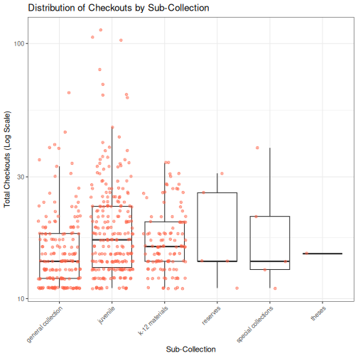

::: objectives
-   Describe the value of reproducible reporting.
-   Create a new Quarto document (`.qmd`) in RStudio.
-   Use Markdown syntax to format text.
-   Create and run code chunks within a Quarto document.
-   Render a Quarto document to an HTML report.
:::

::: questions
-   How can I combine my code, results, and narrative into a single document?
-   How can I automatically update my reports when my data changes?
-   What is Quarto and how does it differ from a standard R script?
:::


## Introduction to Reproducible Reporting

So far, we have been writing code in `.R` scripts. This is excellent for data analysis, but what happens when you need to share your findings with a colleague or a library director? You might copy a plot into a Word document or an email, then type out your interpretation.

But what if the data changes next month? You would have to re-run your script, re-save the plot, copy it back into Word, and update your text. This manual process is prone to errors and tedious.

**Quarto** allows you to combine your code, its output (plots, tables), and your narrative text into a single document. When you "render" the document, R runs the code and produces a polished report (HTML, PDF, or Word) automatically.

## Creating a Quarto Document

To create a new Quarto document in RStudio:

1.  Click the **File** menu.
2.  Select **New File** \> **Quarto Document...**
3.  In the dialog box, give your document a **Title** (e.g., "Library Usage Report") and enter your name as **Author**.
4.  Ensure **HTML** is selected as the output format.
5.  Click **Create**.

RStudio will open a new file with some example content. Notice the file extension is `.qmd`.

::: callout
## Quarto vs. RMarkdown

If you have used R before, you might be familiar with RMarkdown (`.Rmd`). Quarto (`.qmd`) is the next-generation version of RMarkdown. It works very similarly but supports more languages (like Python and Julia) and has better features for scientific publishing.
:::

## Anatomy of a Quarto Document

A Quarto document has three main parts:

### 1. The YAML Header

At the very top, enclosed between two lines of `---`, is the **YAML Header**. This contains metadata about the document.

``` yaml
---
title: "Library Usage Report"
author: "Your Name"
format: html
---
```

### 2. Markdown Text

The white space is where you write your narrative. You use **Markdown** syntax to format text.

-   `**Bold**` for **bold text**
-   `*Italics*` for *italics*
-   `# Heading 1` for a main title
-   `## Heading 2` for a section title
-   `- List item` for bullet points

### 3. Code Chunks

Code chunks are where your R code lives. They start with ```` ```{r} ```` and end with ```` ``` ````.


``` r
# This is a code chunk
summary(cars)
```

``` output
     speed           dist       
 Min.   : 4.0   Min.   :  2.00  
 1st Qu.:12.0   1st Qu.: 26.00  
 Median :15.0   Median : 36.00  
 Mean   :15.4   Mean   : 42.98  
 3rd Qu.:19.0   3rd Qu.: 56.00  
 Max.   :25.0   Max.   :120.00  
```

You can insert a new chunk by clicking the **+C** button in the editor toolbar, or by pressing <kbd>Ctrl</kbd>+<kbd>Alt</kbd>+<kbd>I</kbd> (Windows/Linux) or <kbd>Cmd</kbd>+<kbd>Option</kbd>+<kbd>I</kbd> (Mac).

## Your First Report

Let's clean up the example file and create a report using our `books` data.

1.  Delete everything in the file *below* the YAML header.
2.  Add a new **setup** code chunk to load our libraries and prepare the data.


::: callout
## Chunk Options

Notice the lines starting with `#|`. These are **chunk options**. - `#| label: setup` gives the chunk a name. - `#| include: false` runs the code but hides the code and output from the final report. This is great for loading data silently.
:::

### Adding Analysis

Now, let's add a section header and some text.

``` markdown
## High Usage Items

We are analyzing items with more than 10 checkouts to understand circulation patterns across sub-collections.
```

Next, insert a new code chunk and paste the plotting code we developed in the previous episode (ggplot2).



Setting `#| echo: false` will display the *plot* in the report, but hide the R *code* that generated it. This is often preferred for reports intended for non-coders.

## Rendering the Document

Now comes the magic. Click the **Render** button (blue arrow icon) at the top of the editor pane.

RStudio will:

1.  Run all your code chunks from scratch.
2.  Generate the plots and results.
3.  Combine them with your text.
4.  Create a new file named `library_usage_report.html` in your project folder.
5.  Open a preview of the report.

:::: challenge
## Challenge: Add a Summary Table

1.  Add a new header `## Summary Statistics` to your Quarto document.
2.  Insert a new code chunk.
3.  Write code to calculate the mean checkouts per format (Hint: use `group_by(format)` and `summarize()`).
4.  Render the document again to see your new table included in the report.

::: solution
## Solution

Add this to your document:

``` markdown
## Summary Statistics

The table below shows the average checkouts for each item format.
```

```{{r}}
#| label: summary-table

books2 %>%
  group_by(format) %>%
  summarize(mean_checkouts = mean(tot_chkout, na.rm = TRUE)) %>%
  arrange(desc(mean_checkouts))
```

Render the document to see the updated report.
:::
::::

## Why This Matters

By using Quarto, your report is now **reproducible**.

If you download a new version of `books.csv` next month:

1.  Save it to your `data/` folder.
2.  Open your Quarto document.
3.  Click **Render**.

Your report will automatically update with the new data, creating a fresh plot and table without you having to copy-paste a single thing.

::: keypoints
-   **Quarto** allows you to mix code and text to create reproducible reports.
-   Use the **YAML header** to configure document metadata like title and output format.
-   **Code chunks** run R code and can display or hide input/output using options like `#| echo: false`.
-   **Rendering** the document executes the code and produces the final output (HTML, PDF, etc.).
-   This workflow saves time and reduces errors when reporting on data that changes over time.
:::
