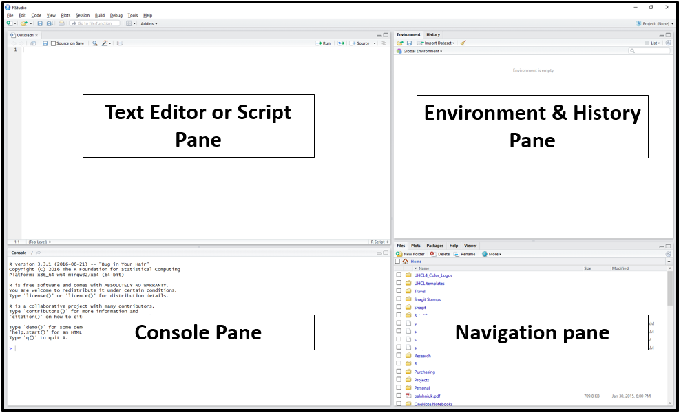

```{r, include=FALSE}
source("../bin/chunk-options.R")
```

This episode is adapted from [Before We
Start](https://datacarpentry.org/r-socialsci/00-intro/index.html) from the R for
Social Scientists Carpentry lesson, licensed under a [Creative Commons
Attribution 4.0 License](https://creativecommons.org/licenses/by/4.0/) (CC BY
4.0).

## What is R? What is RStudio?

`R` is more of a programming language than just a statistics program. It was
started by Robert Gentleman and Ross Ihaka from the University of Auckland in 1995. They [described it
as](http://biostat.mc.vanderbilt.edu/wiki/pub/Main/JeffreyHorner/JCGSR.pdf) "a
language for data analysis and graphics." You can use R to create, import, and
scrape data from the web; clean and reshape it; visualize it; run statistical
analysis and modeling operations on it; text and data mine it; and much more.
The term "`R`" is used to refer to both the programming language and the
software that interprets the scripts written using it.


[RStudio](https://rstudio.com) is a user interface for working with R. It is
called an Integrated Development Environment (IDE): a piece of software that
provides tools to make programming easier.  RStudio acts as a sort of wrapper
around the R language. You can use R without RStudio, but it's much more
limiting. RStudio makes it easier to import datasets, create and write scripts,
and makes using R much more effective. RStudio is also free and open source. To
function correctly, RStudio needs R and therefore both need to be installed on
your computer.


## Why learn R?

### R does not involve lots of pointing and clicking, and that's a good thing

The learning curve might be steeper than with other software, but with R, the
results of your analysis do not rely on remembering a succession of pointing
and clicking, but instead on a series of written commands, and that's a good
thing! So, if you want to redo your analysis because you collected more data,
you don't have to remember which button you clicked in which order to obtain
your results; you just have to run your script again.

Working with scripts makes the steps you used in your analysis clear, and the
code you write can be inspected by someone else who can give you feedback and
spot mistakes. It  forces you to have a deeper understanding of what you are
doing, and facilitates your learning and comprehension of the methods you use.

### R code is great for reproducibility

Reproducibility is when someone else (including your future self) can obtain the
same results from the same dataset when using the same analysis.

R integrates with other tools to generate manuscripts from your code. If you
collect more data, or fix a mistake in your dataset, the figures and the
statistical tests in your manuscript are updated automatically.

An increasing number of journals and funding agencies expect analyses to be
reproducible, so knowing R will give you an edge with these requirements.


### R is interdisciplinary and extensible

With 10,000+ packages that can be installed to extend its capabilities, R
provides a framework that allows you to combine statistical approaches from many
scientific disciplines to best suit the analytical framework you need to analyze your
data. For instance, R has packages for image analysis, GIS, time series, population
genetics, and a lot more.


### R works on data of all shapes and sizes

The skills you learn with R scale easily with the size of your dataset. Whether
your dataset has hundreds or millions of lines, it won't make much difference to
you.

R is designed for data analysis. It comes with special data structures and data
types that make handling of missing data and statistical factors convenient.

R can connect to spreadsheets, databases, and many other data formats, on your
computer or on the web.


### R produces high-quality graphics

The plotting functionalities in R are endless, and allow you to adjust any
aspect of your graph to convey most effectively the message from your data.


### R has a large and welcoming community


Thousands of people use R daily. Many of them are willing to help you through
mailing lists and websites such as [Stack Overflow](https://stackoverflow.com/), 
or on the [RStudio community](https://community.rstudio.com/). Questions which 
are backed up with [short, reproducible code
snippets](https://www.tidyverse.org/help/) are more likely to attract 
knowledgeable responses.


### Not only is R free, but it is also open-source and cross-platform

R is also free and open source, distributed under the terms of the [GNU General
Public License.](https://www.gnu.org/licenses/gpl-3.0.en.html). This means it is
free to download and use the software for any purpose, modify it, and share it.
Anyone can inspect the source code to see how R works. Because of this
transparency, there is less chance for mistakes, and if you (or someone else)
find some, you can report and fix bugs. As a result, R users have created
thousands of packages and software to enhance user experience and functionality.


Because R is open source and is supported by a large community of developers and
users, there is a very large selection of third-party add-on packages which are
freely available to extend R's native capabilities.


<figure>
```{r rstudio-analogy, echo=FALSE, fig.cap="RStudio extends what R can do, and makes it easier to write R code and interact with R."}	
knitr::include_graphics("../fig/r+rstudio-analogy.jpg")
```
<figcaption>
RStudio extends what R can do, and makes it easier to write R code and interact
with R. <a href="https://commons.wikimedia.org/w/index.php?curid=2447462">Left photo credit</a>; <a href="https://commons.wikimedia.org/w/index.php?curid=44599363">right photo credit</a>. 
</figcaption>
</figure>

### R and librarianship

For at least the last decade, librarians have been grappling with the ways that
the "data deluge" affects our work on multiple levels--collection development,
analyzing usage of the library website/space/collections, reference services,
information literacy instruction, research support, accessing bibliographic metadata from third parties, and more.

By using R or any advanced data analysis platform (such as Python), libraries
can harness data in order to:

* Clean messy data from the ILS & vendors
    + multiple repeated fields
    + clean ISBNs, ISSNs, other identifiers
    + detect data errors & anomalies
    + normalize names (e.g. databases, ebooks, serials)
    + create custom subsets
* Merge and analyze data, e.g.
    + holdings and usage data from the same vendor
    + print book & ebook holdings
    + COUNTER statistics
    + institutional data
* Recode variables 
* Manipulate dates and times
* Create visualizations
* Provide data reference services
* Access data via APIs, including Crossref, Unpaywall, ORCID, and Sherpa-ROMeO
* Write documents to communicate findings 


## Knowing your way around RStudio

Let's start by learning about [RStudio](https://www.rstudio.com/), which is an
Integrated Development Environment (IDE) for working with R.

The RStudio IDE open-source product is free under the
[Affero General Public License (AGPL) v3](https://www.gnu.org/licenses/agpl-3.0.en.html).
The RStudio IDE is also available with a commercial license and priority email
support from RStudio, Inc.

We will use the RStudio IDE to write code, navigate the files on our computer,
inspect the variables we create, and visualize the plots we generate. RStudio 
can also be used for other things (e.g., version control, developing packages, 
writing Shiny apps) that we will not cover during the workshop. 

One of the advantages of using RStudio is that all the information
you need to write code is available in a single window. Additionally, RStudio 
provides many shortcuts, autocompletion, and highlighting for the major file 
types you use while developing in R. RStudio makes typing easier and less
error-prone.


## Getting set up

It is good practice to keep a set of related data, analyses, and text
self-contained in a single folder called the **working directory**. All of the
scripts within this folder can then use *relative paths* to files. Relative paths
indicate where inside the project a file is located (as opposed to absolute paths, 
which point to where a file is on a specific computer). Working this way makes it
a lot easier to move your project around on your computer and share it with
others without having to directly modify file paths in the individual scripts.

RStudio provides a helpful set of tools to do this through its "Projects"
interface, which not only creates a working directory for you but also remembers
its location (allowing you to quickly navigate to it). The interface also 
(optionally) preserves custom settings and open files to make it easier to 
resume work after a break. 


### Create a new project

* Under the `File` menu, click on `New project`, choose `New directory`, then
`New project`
* Enter the name `library_carpentry` for this new folder (or "directory"). This
will be your **working directory** for the rest of the day.
* Click on `Create project`
* Create a new file where we will type our scripts. Go to File > New File > R
script. Click the save icon on your toolbar and save your script as
"`script.R`".
  
### The RStudio Interface  
Let's take a quick tour of RStudio.

<figure>
```{r rstudio-panes, echo=FALSE, fig.cap="R Studio"}	

```
</figure>

RStudio is divided into four "panes". The placement of these
panes and their content can be customized (see menu, Tools -> Global Options ->
Pane Layout).  

The Default Layout is:
- **Console Pane** (bottom left)
If you were just using the basic R interface, without RStudio, this is all you
would see. You use this to type in a command and press enter to immediately
evaluate it. It includes a `>` symbol and a blinking cursor prompting you to
enter some code. Code that you type directly in the console will not be saved,
though it is available in the History Pane. You can try it out by typing `2 + 2`
into the console.

- **Script Pane** (top left) 
This is sort of like a text editor, or a place to draft and save code. You then
tell RStudio to run the line of code, or multiple lines of code, and you can see
it appear in the console as it is running. Then save the script as a .R file for
future use, or to share with others.

- **Environment/History Pane** (top right)
This will display the objects that you've read into what is called the "global
environment." When you read a file into R, or manually create an R object, it
enters into the computer's working memory. When we manipulate or run operations
on that data, it isn't written to a file until we tell it to. It is kept here in
the RStudio environment. The History tab displays all commands that have been
executed in the console.

- **Navigation Pane** (bottom right)
This pane has multiple functions:

    * **Files:** Navigate to files saved on your computer and in your working directory
    * **Plots:** View plots (e.g. charts and graphs) you have created
    * **Packages:** view add-on packages you have installed, or install new packages
    * **Help:** Read help pages for R functions
    * **Viewer:** View local web content

## Interacting with R

The basis of programming is that we write down instructions for the computer to
follow, and then we tell the computer to follow those instructions. We write, or
*code*, instructions in R because it is a common language that both the computer
and we can understand.


There are two main ways of interacting with R: by using the console or by using
script files (plain text files that contain your code). The console pane (in
RStudio, the bottom left panel) is the place where commands written in the R
language can be typed and executed immediately by the computer. It is also where
the results will be shown for commands that have been executed. You can type
commands directly into the console and press <kbd>Enter</kbd> to execute those commands,
but they will be forgotten when you close the session.


The *prompt* is the blinking cursor in the console pane prompting you to take
action, in the lower-left corner of R Studio. If R is ready to accept commands,
the R console shows a `>` prompt. If R receives a command (by typing,
copy-pasting, or sent from the script editor using <kbd>Ctrl</kbd> +
<kbd>Enter</kbd>), R will try to execute it and, when ready, will show the
results and come back with a new `>` prompt to wait for new commands. We type
*commands* into the prompt, and press the Enter key to *evaluate* (also called
*execute* or *run*) those commands.

You can use R like a calculator:
```{r console, comment=NA, eval=FALSE}
2 + 2    # Type 2 + 2 in the console to run the command
```

While in the console, you can press the up and down keys on your keyboard to cycle through previously executed commands.


Because we want our code and workflow to be reproducible, it is better to type
the commands we want in the script editor and save the script. This way, there
is a complete record of what we did, and anyone (including our future selves!)
can easily replicate the results on their computer.

RStudio allows you to execute commands directly from the script editor by using
the <kbd>Ctrl</kbd> + <kbd>Enter</kbd> shortcut (on Mac, <kbd>Cmd</kbd> +
<kbd>Return</kbd> will work). The command on the current line in the
script (indicated by the cursor) or all of the commands in
selected text will be sent to the console and executed when you press
<kbd>Ctrl</kbd> + <kbd>Enter</kbd>. If there is information in the console
you do not need anymore, you can clear it with <kbd>Ctrl</kbd> + <kbd>L</kbd>.
You can find other keyboard shortcuts in this
[RStudio cheatsheet about the RStudio IDE](https://github.com/rstudio/cheatsheets/raw/master/rstudio-ide.pdf).

At some point in your analysis, you may want to check the content of a variable
or the structure of an object without necessarily keeping a record of it in
your script. You can type these commands and execute them directly in the
console.  RStudio provides the <kbd>Ctrl</kbd> + <kbd>1</kbd> and
<kbd>Ctrl</kbd> + <kbd>2</kbd> shortcuts allow you to jump between the
script and the console panes.


If R is still waiting for you to enter more text,
the console will show a `+` prompt. It means that you haven't finished entering
a complete command. This is likely because you have not 'closed' a parenthesis or
quotation, i.e. you don't have the same number of left-parentheses as
right-parentheses or the same number of opening and closing quotation marks.
When this happens, and you thought you finished typing your command, click
inside the console window andx press <kbd>Esc</kbd>; this will cancel the
incomplete command and return you to the `>` prompt. You can then proofread
the command(s) you entered and correct the error.


## Installing additional packages using the packages tab

When you download R it already has a number of functions built in: these
encompass what is called **Base R.** However, many R users write their own
**libraries** of functions, package them together in **R Packages**, and provide
them to the R community at no charge. This extends the capacity of R and allows
us to do much more. In many cases, they improve on the Base R functions by
making them easier and more straightforward to use. In the course of this lesson
we will be making use of several of these packages, such as `ggplot2` and
`dplyr`.

The [Comprehensive R Archive Network
(CRAN)](https://cran.r-project.org/web/packages/available_packages_by_name.html)
is the main repository for R packages, and that organization maintains [strict
standards](https://cran.r-project.org/web/packages/policies.html) in order for a
package to be listed--for example, it must include clear descriptions of the
functions, and it must not track or tamper with the user's R session. See [this
page from
RStudio](https://support.rstudio.com/hc/en-us/articles/201057987-Quick-list-of-useful-R-packages)
for a good list of useful R packages. In addition to CRAN, R users can make
their code and packages available from [GitHub](https://github.com/trending/r).
Finally, some communities host their own collections of R packages, such as
[Bioconductor](https://bioconductor.org/) for computational biology and
bioinformatics.

## Installing Packages

Installing CRAN packages can be done from the RStudio console. Click the
Packages tab in the Navigation Pane, then click Install and search for the
package you're looking for. You can also use the `install.packages()` function
directly in the console. Run `help(install.packages)` to learn more about how to
do it this way.


Additional packages can be installed from the ‘packages’ tab.
On the packages tab, click the ‘Install’ icon and start typing the
name of the package you want in the text box. As you type, packages
matching your starting characters will be displayed in a drop-down
list so that you can select them.

<figure>
```{r install-packages, echo=FALSE, fig.cap="Click on the Packages tab in the Navigation Pane to download packages from CRAN."}	
knitr::include_graphics("../fig/R_00_Rstudio_03.png")
```
<figcaption>
Click on the Packages tab in the Navigation Pane to download packages from CRAN. 
</figcaption>
</figure>

At the bottom of the Install Packages window is a check box to
‘Install’ dependencies. This is ticked by default, which is usually
what you want. Packages can (and do) make use of functionality
built into other packages, so for the functionality contained in
the package you are installing to work properly, there may be other
packages which have to be installed with them. The ‘Install
dependencies’ option makes sure that this happens.

> ## Exercise
>
> Use the install option from the packages tab to install the ‘tidyverse’ package.
> 
> > ## Solution
> > From the packages tab, click ‘Install’ from the toolbar and type ‘tidyverse’ into the textbox, then click ‘install’.
> > The ‘tidyverse’ package is really a package of packages, including 'ggplot2' and 'dplyr', both of which require other packages to run correctly. All of these packages will be installed automatically. 
> > Depending on what packages have previously been installed in your R environment, the install of ‘tidyverse’ could be very quick or could take several minutes.
> > As the install proceeds, messages relating to its progress will be written to the console. You will be able to see all of the packages which are actually being installed.
> {: .solution}
{: .challenge}

Because the install process accesses the CRAN repository, you
will need an Internet connection to install packages.

It is also possible to install packages from other repositories, as
well as Github or the local file system, but we won’t be looking at these options in this lesson.

## Installing additional packages using R code

If you were watching the console window when you started the
install of ‘tidyverse’, you may have noticed that the line

```{r, eval = FALSE}
install.packages("tidyverse")
```

was written to the console before the start of the installation messages.

You could also have installed the **`tidyverse`** packages by running this command directly in the R console.


## R Resources

### Learning R
1. `swirl` is a package you can install in R to learn about R and data science
interactively. Just type `install.packages("swirl")` into your R console, load
the package by typing `library("swirl")`, and then type `swirl()`. Read more at
<http://swirlstats.com/>.

2. [Try R](http://tryr.codeschool.com/) is a browser-based interactive tutorial
developed by Code School.

3. Anthony Damico's
[twotorials](https://www.youtube.com/playlist?list=PLcgz5kNZFCkzSyBG3H-rUaPHoBXgijHfC)
are a series of 2 minute videos demonstrating several basic tasks in R.

4. [Cookbook for R](http://www.cookbook-r.com/) by Winston Change provides
solutions to common tasks and problems in analyzing data.

5. If you're up for a challenge, try the free [R Programming MOOC in
Coursera](https://www.coursera.org/learn/r-programming) by Roger Peng.

6. Books:
* [R For Data Science](http://r4ds.had.co.nz/) by Garrett Grolemund & Hadley
Wickham [free] 
* [An Introduction to Data Cleaning with
R](https://cran.r-project.org/doc/contrib/de_Jonge+van_der_Loo-Introduction_to_data_cleaning_with_R.pdf)
by Edwin de Jonge & Mark van der Loo [free] 
* [YaRrr! The Pirate's Guide to
R](https://bookdown.org/ndphillips/YaRrr/) by Nathaniel D. Phillips [free] 
* Springer's [Use R!](https://link.springer.com/bookseries/6991) series [not free]
is mostly specialized, but it has some excellent introductions including Alain
F. Zuur et al.'s [A Beginner's Guide to
R](https://link.springer.com/book/10.1007/978-0-387-93837-0) and Phil Spector's
[Data Manipulation in
R](https://link.springer.com/book/10.1007/978-0-387-74731-6).

### Data

If you need some data to play with, type `data()` in the console for a list of
data sets. To load a dataset, type it like this: `data(mtcars)`. Type
`help(mtcars)` to learn more about it. You can then perform operations, e.g.
```{r dataloading, comment=NA, eval=F}
head(mtcars)
nrow(mtcars)
mean(mtcars$mpg)
sixCylinder <- mtcars[mtcars$cyl == 6, ]
```

See also rdatamining.com's [list of free datasets](http://www.rdatamining.com/resources/data).

### Cheat Sheets

* [Base R Cheat Sheet](https://paulvanderlaken.files.wordpress.com/2017/08/base-r-cheetsheat.pdf) by Mhairi McNeill
* [Data Transformation with dplyr Cheat Sheet](https://github.com/rstudio/cheatsheets/blob/master/data-transformation.pdf) by RStudio
* [Data Wrangling with dplyr and tidyr Cheat Sheet](https://paulvanderlaken.files.wordpress.com/2017/08/ddplyr-cheatsheet-data-wrangling-plyr.pdf) by RStudio
* [Complete list of RStudio cheatsheets](https://github.com/rstudio/cheatsheets/)

### Style guides
Use these resources to write cleaner code, according to established style conventions

* Hadley Wickham's [Style Guide](http://adv-r.had.co.nz/Style.html)
* Google's [R Style Guide](https://google.github.io/styleguide/Rguide.xml)
* Tip: highlight code in your script pane and press **Ctrl/Cmd + I** on your keyboard to automatically fix the indents

## Credit
Parts of this episode have been inspired by the following:

* ["Before We Start"](https://datacarpentry.org/r-socialsci/00-intro/index.html) R for Social Scientists Carpentry Lesson. CC BY 4.0.
* Roger Peng's [Computing for Data Analysis videos](https://www.youtube.com/playlist?list=PLjTlxb-wKvXNSDfcKPFH2gzHGyjpeCZmJ)
* Lisa Federer's [Introduction to R for Non-Programmers](archived at https://web.archive.org/web/20180726071634/http://nihlibrary.campusguides.com/dataservices/intro_to_r)
* Brad Boehmke's [Intro to R Bootcamp](https://uc-r.github.io/r_bootcamp)
